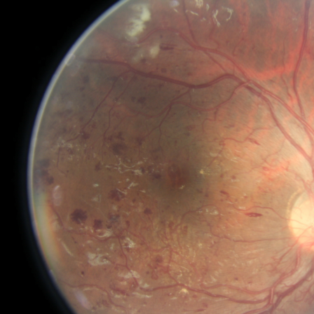
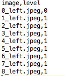

# 如何利用训练好的模型对单张图像进行分类

## 1. 测试如何用pytorch进行图像处理

主要用到torchvision的transforms中的方法。

如果没有安装torchvision，请参考如下链接进行安装：
[torchvision](https://github.com/pytorch/vision)

```
import torchvision.transforms as transforms
```

torchvision.transforms中有各种现成的方法可以用：
```python
Normalize
Scale
CenterCrop
Pad
Lambda
RandomCrop
RandomHorizontalFlip
RandomSizedCrop
``` 
简单的处理如下：
```python
from PIL import Image
import torchvision.transforms as transforms

img = Image.open('../sample/3/16_left.jpeg')

img.show()

trans = transforms.Compose([
    transforms.Scale(512),
    transforms.RandomCrop(448)
])

img1 = trans(img)
img1.show()
```

上述代码，是利用pytorch torchvision中的transforms对图像进行处理的结果。





其中的```ToTensor```和```ToPILImage```可以支持image和tensor数据的相互转换，【0.0，1.0】到【0，255】的数据范围转换，相应的也会有通道位置的调整。

有了上述前提，可以将图片转换为pytorch需要的tensor结构，也可以从pytorch的tensor结构转换为图像进行显示。

## 2. 如何将生成结果写入csv文件

先写个简单的例子，将图片和分级结果写成类似```./test/trainLabels.csv```的文件格式。
参考[python：读取CSV文件的相关技巧](http://blog.csdn.net/u013250416/article/details/53189019)

示例代码如下：

```python
import pandas as pd

imagelist = ['0_left.jpeg', '1_left.jpeg', '2_left.jpeg', '3_left.jpeg',
             '4_left.jpeg', '5_left.jpeg', '6_left.jpeg', '7_left.jpeg', '8_left.jpeg']
catalist = []

for i in imagelist:
    if '0' in i:
        catalist.append(0)
    else:
        catalist.append(1)

list = ['image', 'level']
cols = pd.DataFrame(columns=list)


datas = {}
datas['image'] = imagelist
datas['level'] = catalist

for id in list:
    cols[id] = datas[id]

cols.to_csv('test.csv', index=False)
```
结果如下：




## 3. 如何成批的读入数据，并将结果写入csv文件


## 4. kappa检验
参考如下文档：
[kappa](http://vassarstats.net/kappaexp.html)
[kappa](http://vassarstats.net/kappa.html)

Dependency:
[benhamner/Metrics](https://github.com/benhamner/Metrics/tree/master/Python)

安装：
```python
pip install ml_metrics
```

代码（详见test/kappa_test.py）:
```python
import ml_metrics

a = [2,2,2,2,5,6,7,8,9,3]
b = [2,2,2,2,2,6,5,7,8,3]

res = ml_metrics.quadratic_weighted_kappa(a,b,2,9)
print(res)
```
运行结果：
```
0.8792270531400966
```